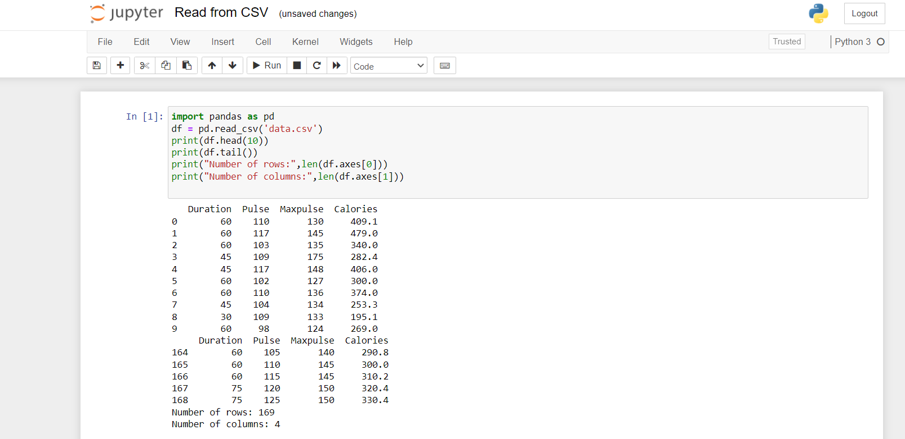

# Inverse-of-matrix

## AIM:
To write  a python program to find the inverse of a nested array.
## ALGORITHM:
### Step 1:
Import numpy as np.
### Step 2:
Create an empty lists.
### Step 3:
Get the values from the user as input.
### Step 4:
Inverse the matrix using linalg library.
### Step 5:
Display the result.

## PROGRAM:

~~~
# To write  a python program to find the inverse of a nested array.
# Developed by : Syed Abdul Wasih H
# Register Number : 212221240057
import numpy as np
l1,l2=[],[]
r=int(input())
c=int(input())
for i in range (r):
    for j in range (c):
        num=int(input())
        l1.append(num)
    l2.append(l1)
    l1=[]
print(l2)
value1=np.array(l2)
inverse=np.linalg.inv(value1)
print(inverse)
~~~

## OUTPUT:

## RESULT:

The program to find the inverse of a nested array is successful.